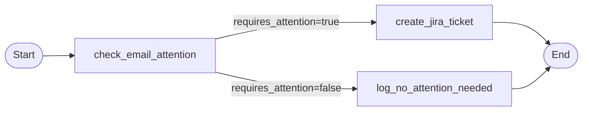
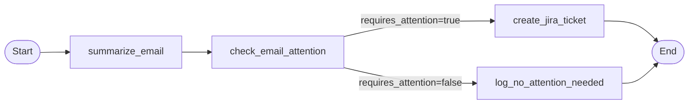

# Add Email Summary Feature

## Original Prompt

> We need to add a new feature to our langgraph support agent. We need to create a summary of the email that summarizes what the email is about

## Clarifying Questions & Answers

**Q1: When should the email summary be generated in the workflow?**
- a) Before attention check (summary could be used to determine if attention is needed)
- b) After attention check (summary is generated for all emails regardless)
- c) Only when attention is required (summary is generated before creating Jira ticket)

**Answer:** Before attention check

**Q2: How should the summary be used?**
- a) Just store it in state as an output
- b) Include it in the Jira ticket description
- c) Both - store in state AND use in Jira ticket

**Answer:** Both - store in state AND use in Jira ticket

## Plan

### Current Flow



### New Flow



### Implementation Changes

#### 1. Update State

Add `email_summary` field to `simple_agent/state.py`:

```python
email_summary: Optional[str]  # New output field
```

#### 2. Create Summary Node

Add new `summarize_email` node in `simple_agent/nodes.py` that:
- Uses `gpt-4o-mini` (consistent with existing node)
- Generates a 2-3 sentence summary of the email
- Returns `{"email_summary": summary}`

#### 3. Update Graph

Modify `simple_agent/agent.py`:
- Add `summarize_email` parameter to `create_graph()` factory
- Add `summarize_email` node to workflow
- Change entry point from `check_email_attention` to `summarize_email`
- Add edge: `summarize_email` -> `check_email_attention`

#### 4. Update Jira Ticket Creation

Modify `create_jira_ticket` in `simple_agent/nodes.py` to include the summary in the ticket description.

#### 5. Add Test Stub and Tests

- Add `summarize_email_stubbed` to `tests/stubs/stub_nodes.py`
- Update `tests/test_graph.py` to verify summary is generated and present in state

